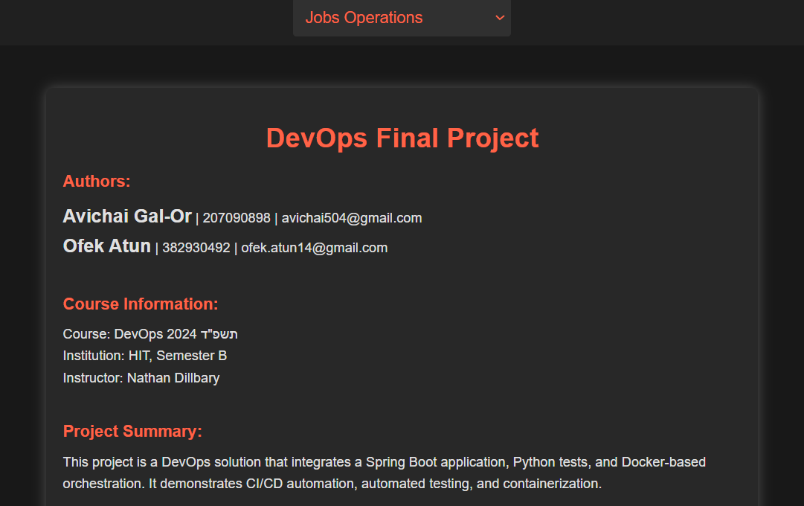
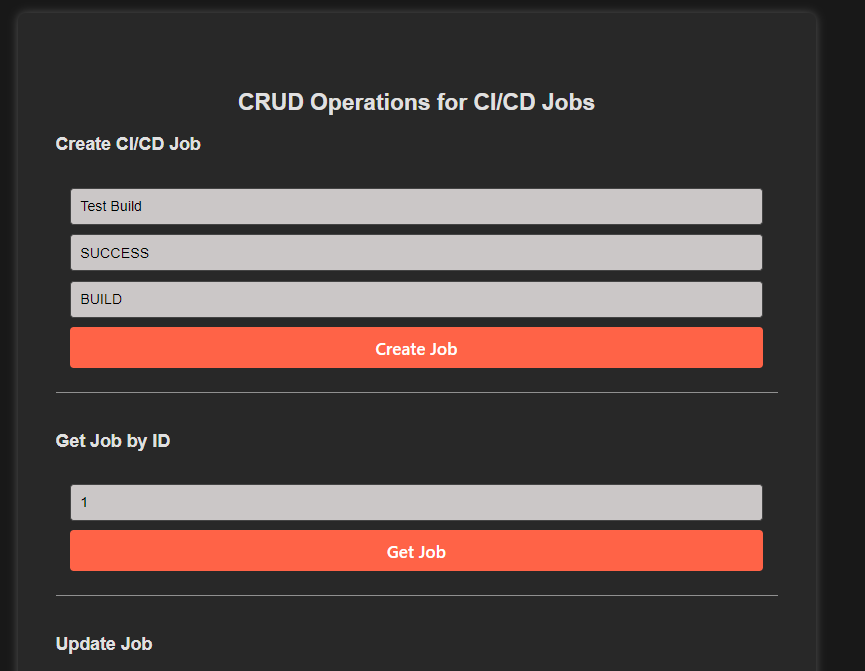

# Final Project: CI/CD Pipeline Management System



## Introduction
This project is a comprehensive CI/CD (Continuous Integration and Continuous Deployment) pipeline management system built using Spring Boot. The system allows developers and DevOps engineers to manage and monitor CI/CD jobs, including creating, updating, deleting, and retrieving job statuses.

The project includes both a RESTful API and an interactive web interface to perform CRUD operations on CI/CD jobs. It is designed to be a central hub for managing CI/CD pipelines across different environments.

## Project Structure
```plaintext
final-project/
│
├── src/
│   ├── main/
│   │   ├── java/
│   │   │   └── hit/
│   │   │       └── final_project/
│   │   │           ├── cicd/          # CI/CD Job related files
│   │   │           │   ├── CICDJob.java
│   │   │           │   ├── CICDJobController.java
│   │   │           │   ├── CICDJobService.java
│   │   │           │   ├── JobNotFoundException.java   # Exception that returns 404 NOT FOUND for missing jobs 
│   │   │           ├── config/        # Configuration files
│   │   │           │   └── DatabaseSeeder.java
│   │   └── resources/
│   │       ├── application.properties # Application configuration
│   │       ├── static/                # Static resources (e.g., images, CSS)
│   │       └── templates/             # HTML templates for the web interface
│
├── test/
│   ├── python/
│   │   └── test_cicd_jobs.py           # Python testing scripts
|   |   └── log/                        # Directory for storing log files
│
├── docker/
│   ├── Dockerfile                      # Dockerfile for building the application image
│   ├── docker-compose.yml              # Docker Compose file for deployment
│
├── target/                            # Compiled classes and resources
├── pom.xml                            # Maven project configuration
└── README.md                          # Project documentation